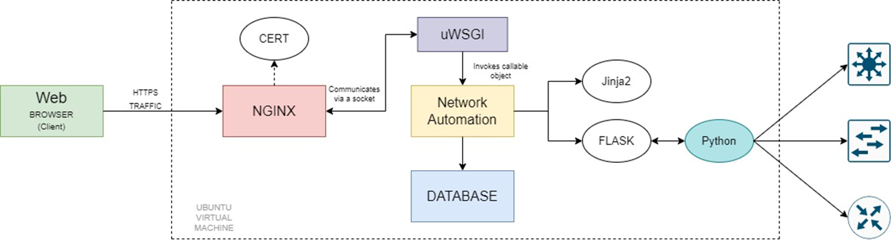
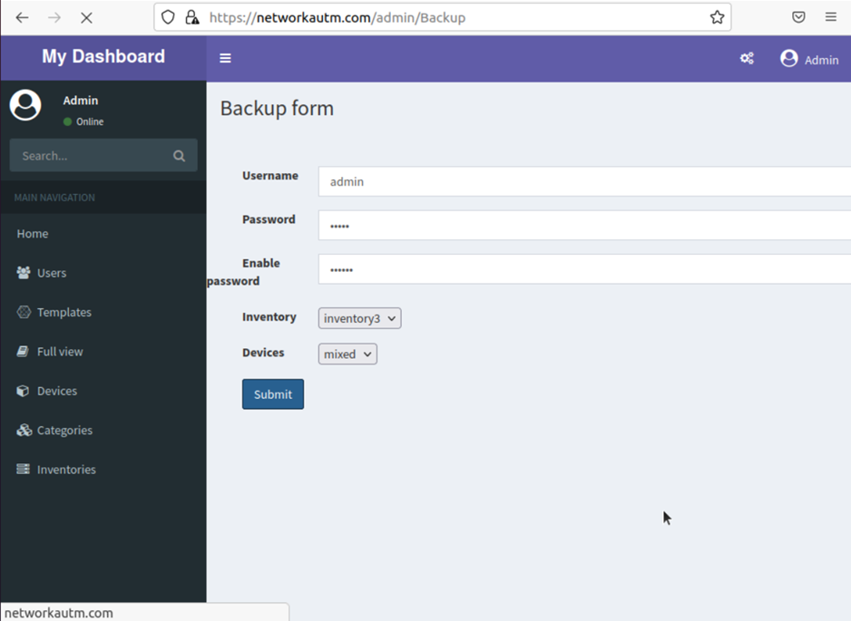
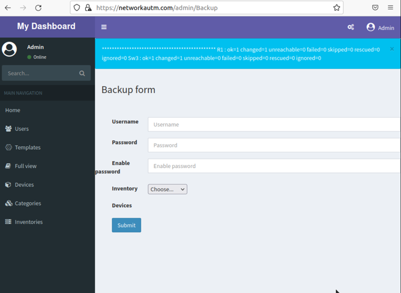
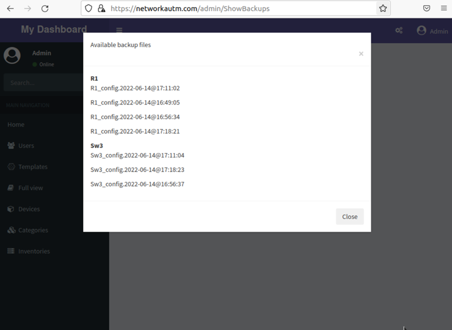

# Flask-Admin Dashboard Network Automation App

Basic dashboard app with Admin LTE template and Flask Admin, it has:

- User Registration
- Login as general or admin user
- Roles management
- Create form in modal window by default
- Inline editing enabled by default
- Skins and  layout customization
- Templates for a number of protocols for CISCO devices
- Python automation scripts using Paramiko, Netmiko, NAPALM and Ansible
 
Utilities: 

  - AdminLTE Bootstrap template
  - Flask-Security
  - Flask-Admin
  - SQLite
  - Customized templates for protocols parameters

### Screenshots

**I hope you enjoy it.**
